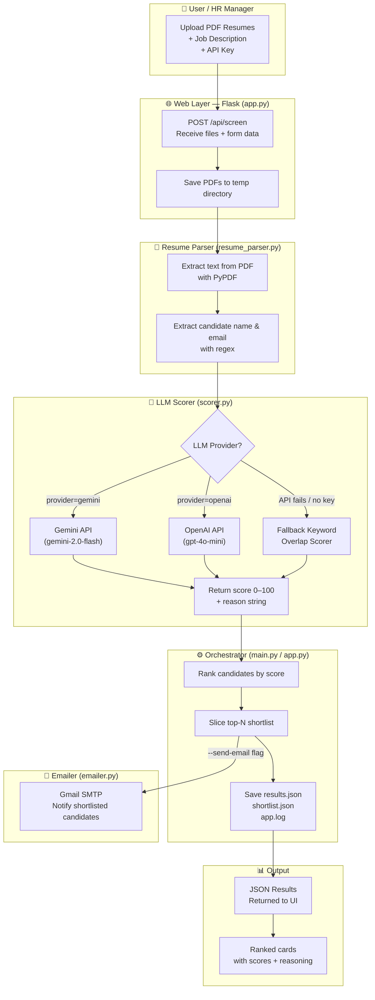

# System Design — AI Resume Screening & Candidate Shortlisting System

## Overview

An end-to-end automation pipeline that takes raw PDF resumes and a job description as input, uses an LLM to semantically score each candidate, ranks them, and optionally emails the shortlist.

---

## Architecture



---

## Components

| File | Role |
|------|------|
| [app.py](file:///e:/Proj%20resume/AI-Resume-Screening-Candidate-Shortlisting-System-main/app.py) | Flask web server — HTTP API, file uploads, request routing |
| [main.py](file:///e:/Proj%20resume/AI-Resume-Screening-Candidate-Shortlisting-System-main/main.py) | CLI entry point — same pipeline without the web layer |
| [resume_parser.py](file:///e:/Proj%20resume/AI-Resume-Screening-Candidate-Shortlisting-System-main/resume_parser.py) | PDF text extraction with `PyPDF`; parses name & email via regex |
| [scorer.py](file:///e:/Proj%20resume/AI-Resume-Screening-Candidate-Shortlisting-System-main/scorer.py) | Calls Gemini / OpenAI API; falls back to keyword overlap scoring |
| [config.py](file:///e:/Proj%20resume/AI-Resume-Screening-Candidate-Shortlisting-System-main/config.py) | Loads all config from [.env](file:///e:/Proj%20resume/AI-Resume-Screening-Candidate-Shortlisting-System-main/.env) using `python-dotenv` |
| [utils.py](file:///e:/Proj%20resume/AI-Resume-Screening-Candidate-Shortlisting-System-main/utils.py) | Logging setup, JSON save, directory creation, console print |
| [emailer.py](file:///e:/Proj%20resume/AI-Resume-Screening-Candidate-Shortlisting-System-main/emailer.py) | Sends shortlist emails over Gmail SMTP |
| [templates/index.html](file:///e:/Proj%20resume/AI-Resume-Screening-Candidate-Shortlisting-System-main/templates/index.html) | Full-stack dark-mode web UI (HTML + CSS + JS) |

---

## Data Flow (Step by Step)

```
1. User uploads N PDFs + job description text via the web UI

2. Flask saves PDFs to a temporary directory

3. resume_parser.py scans the temp dir:
   → For each PDF: extract text (PyPDF) + regex for name/email
   → Returns list of structured dicts

4. scorer.py scores each resume:
   → Builds prompt: JD + resume text (truncated to 6000 chars each)
   → Calls Gemini/OpenAI REST API → returns {score: 0-100, reason: "..."}
   → On API failure → fallback: keyword overlap percentage

5. Pipeline ranks all candidates by score (descending)

6. Top-N slice → shortlisted candidates

7. Results returned as JSON to the web UI (or saved to output/ files)

8. Optional: emailer.py sends SMTP emails to shortlisted candidates
```

---

## Tech Stack

| Layer | Technology |
|-------|-----------|
| Language | Python 3.11 |
| Web Framework | Flask 3.x |
| PDF Parsing | `pypdf 5.1.0` |
| HTTP Calls (LLM API) | `requests 2.32.3` |
| Config Management | `python-dotenv 1.0.1` |
| AI Scoring | Google Gemini `gemini-2.0-flash` or OpenAI `gpt-4o-mini` |
| Email | Gmail SMTP (TLS port 587) |
| Frontend | Vanilla HTML / CSS / JavaScript (no frameworks) |

---

## Key Design Decisions

- **Fallback scoring**: If the LLM API is unavailable or rate-limited, the system auto-falls back to a keyword overlap scorer so the pipeline never crashes.
- **No persistence**: Uploaded files are stored only in a temporary directory; they are auto-deleted after each request. No database needed.
- **Settings injection**: The [app.py](file:///e:/Proj%20resume/AI-Resume-Screening-Candidate-Shortlisting-System-main/app.py) runtime patches `config.settings` per-request so API keys entered in the UI override [.env](file:///e:/Proj%20resume/AI-Resume-Screening-Candidate-Shortlisting-System-main/.env) values — making it multi-user friendly.
- **Rate limiting**: A 2-second sleep between scoring calls prevents hitting free-tier API rate limits.
- **Modular design**: [app.py](file:///e:/Proj%20resume/AI-Resume-Screening-Candidate-Shortlisting-System-main/app.py) and [main.py](file:///e:/Proj%20resume/AI-Resume-Screening-Candidate-Shortlisting-System-main/main.py) both reuse the same [scorer.py](file:///e:/Proj%20resume/AI-Resume-Screening-Candidate-Shortlisting-System-main/scorer.py), [resume_parser.py](file:///e:/Proj%20resume/AI-Resume-Screening-Candidate-Shortlisting-System-main/resume_parser.py), and [utils.py](file:///e:/Proj%20resume/AI-Resume-Screening-Candidate-Shortlisting-System-main/utils.py) modules — web UI and CLI share one codebase.
